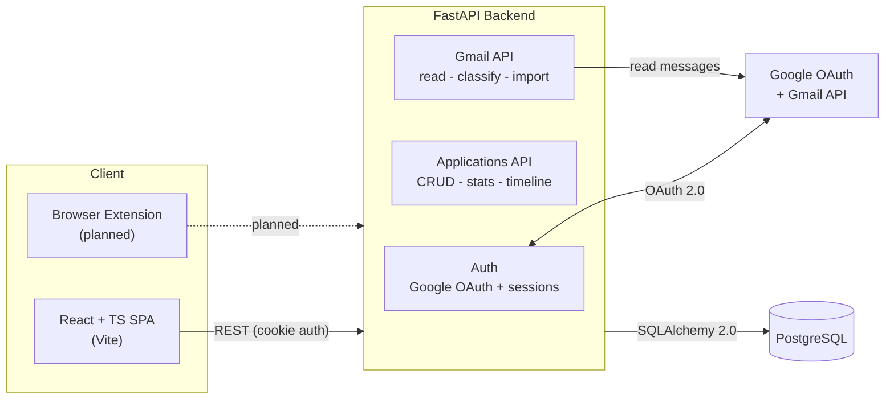
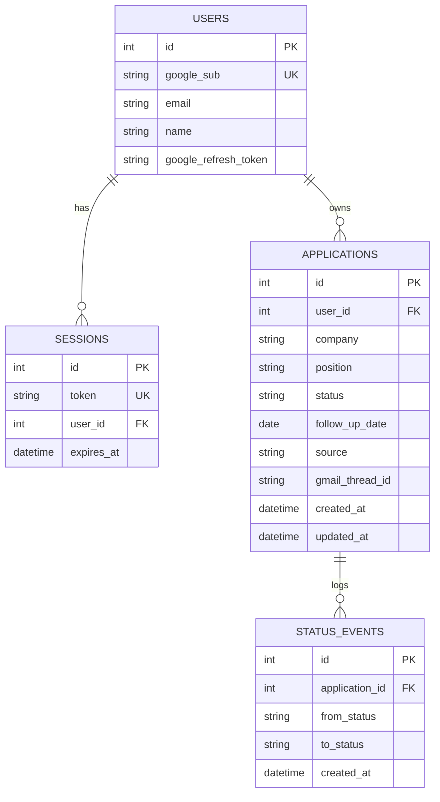

# OfferFlow

**A full-stack job & internship application tracker that turns a chaotic job search into an organized, actionable pipeline.**

OfferFlow lets you capture applications, move them through a visual hiring pipeline, track every status change on a timeline, get colour-coded follow-up reminders, and even auto-import applications from your Gmail — all behind Google sign-in.

[](https://github.com/JIMMSTERS/full_stack_jobapp_proj/actions/workflows/ci.yml)
&nbsp;
&nbsp;
&nbsp;
&nbsp;
&nbsp;

---

## Demo

<!-- Record a ~60s screen capture (login -> add application -> drag across Kanban -> open detail drawer -> toggle dark theme) and save it as docs/demo.gif to embed it here. -->

_A short demo GIF lives here once recorded (`docs/demo.gif`)._ In the meantime, [Local development](#local-development) gets you running in a couple of minutes.

---

## Highlights

- **Google OAuth + server-side sessions** — sign in with Google; sessions are opaque, httpOnly-cookie backed, and stored server-side (no JWT-in-localStorage foot-guns).
- **Two ways to view your pipeline** — a **drag-and-drop Kanban board** (powered by dnd-kit) and a **sortable, searchable, filterable table**, kept in sync.
- **Activity timeline** — every status change is recorded as an immutable event and rendered as a per-application history in a slide-out detail drawer.
- **Follow-up reminders** — set a next-action date and get colour-coded urgency pills (overdue / due soon / later) that automatically hide once an application is closed.
- **Gmail import** — reads your recent mail, heuristically classifies job-related messages, guesses the company/status, and imports them as applications (deduped by Gmail thread).
- **Dashboard metrics** — live counts by status so you can see the shape of your funnel at a glance.
- **Command palette** — `Ctrl/Cmd-K` to jump around and act fast (cmdk).
- **Polished UX** — five selectable themes including dark modes, skeleton loading states, and toast notifications.
- **Engineered like production** — Alembic migrations, 49 automated tests, GitHub Actions CI, and env-driven config ready for split-domain deployment.

---

## Architecture



**Request flow:** the SPA calls the API with `credentials: include`; a session middleware resolves the opaque cookie to a `User`, and every query is scoped to that user. Schema changes ship as Alembic migrations that run automatically on deploy.

---

## Tech Stack

| Layer          | Technology                                                                 |
| -------------- | -------------------------------------------------------------------------- |
| Frontend       | React 18, TypeScript, Vite 5, dnd-kit, cmdk, sonner                         |
| Backend        | Python 3.12, FastAPI, SQLAlchemy 2.0 (typed `Mapped` models), Pydantic v2   |
| Auth           | Authlib (Google OAuth 2.0), server-side sessions via httpOnly cookie        |
| Database       | PostgreSQL (production) - SQLite (local dev) - Alembic migrations           |
| Integrations   | Gmail API (google-api-python-client)                                        |
| Testing        | pytest + httpx (backend) - Vitest + React Testing Library (frontend)        |
| CI / Infra     | GitHub Actions - Render blueprint (`render.yaml`) - Vercel-ready frontend   |

---

## Data Model



Every `Application` belongs to a `User` and carries an ordered list of `StatusEvent`s — one when it first appears (`from_status = NULL`) and one per subsequent status change — which powers the activity timeline. Cascades keep sessions, applications, and events tidy when a parent is deleted.

---

## API Reference

All application and Gmail routes require an authenticated session cookie and are scoped to the current user.

| Method   | Endpoint                          | Description                                        |
| -------- | --------------------------------- | -------------------------------------------------- |
| `GET`    | `/auth/login`                     | Begin the Google OAuth flow                         |
| `GET`    | `/auth/callback`                  | OAuth callback; sets the session cookie             |
| `POST`   | `/auth/logout`                    | End the session and clear the cookie                |
| `GET`    | `/auth/me`                        | Current authenticated user                          |
| `GET`    | `/applications`                   | List the user's applications                        |
| `POST`   | `/applications`                   | Create an application                                |
| `GET`    | `/applications/stats`             | Status counts for the dashboard                     |
| `GET`    | `/applications/{id}`              | Fetch a single application                          |
| `GET`    | `/applications/{id}/events`       | Activity timeline for an application                |
| `PATCH`  | `/applications/{id}`              | Update fields / status (records a timeline event)   |
| `DELETE` | `/applications/{id}`              | Delete an application                               |
| `GET`    | `/gmail/messages`                 | Recent Gmail messages with job-related classification |
| `POST`   | `/gmail/import`                   | Import classified messages as applications          |

Interactive OpenAPI docs are available at `/docs` when the server is running.

---

## Engineering Practices

- **Typed end to end** — SQLAlchemy 2.0 `Mapped[...]` models, Pydantic v2 schemas, and strict-mode TypeScript.
- **Migrations, not `create_all`** — every schema change is a reviewed Alembic revision; the production start command runs `alembic upgrade head` before serving.
- **Tested** — 36 backend tests (isolated in-memory SQLite per test with dependency-overridden auth) and 13 frontend tests (pure logic + component behaviour).
- **CI on every push/PR** — GitHub Actions runs `pytest` and the frontend test + build in parallel.
- **Security-minded** — httpOnly, `SameSite`/`Secure`-configurable session cookies; per-user data scoping on every query; secrets kept out of source via env vars.
- **Deployment-ready** — env-driven CORS origins and cross-site cookie flags, proxy-aware startup, and a one-file Render blueprint.

---

## Local Development

### Prerequisites
- Python 3.12+
- Node.js 20+
- (Optional) PostgreSQL — or use SQLite locally with zero setup.

### 1. Backend

```bash
cd backend
python -m venv .venv
# Windows: .venv\Scripts\activate   -   macOS/Linux: source .venv/bin/activate
pip install -r requirements.txt -r requirements-dev.txt

cp .env.example .env          # then fill in the values (see below)
alembic upgrade head          # create the schema
uvicorn app.main:app --reload --port 8000
```

For a zero-dependency local database, set `DATABASE_URL=sqlite:///./offerflow.db` in `.env`.

**Google OAuth setup:** create OAuth credentials in the Google Cloud Console, add
`http://127.0.0.1:8000/auth/callback` as an authorized redirect URI, and put the client
ID/secret in `.env`. Then browse to the app via `http://127.0.0.1:5173` (not `localhost`).

### 2. Frontend

```bash
cd frontend
npm install
npm run dev                   # http://127.0.0.1:5173
```

The frontend reads the API base URL from `VITE_API_URL` (defaults to `http://127.0.0.1:8000`).

---

## Testing

```bash
# Backend
cd backend && pytest -q

# Frontend
cd frontend && npm test
```

---

## Deployment

The repo is wired for a split-domain deploy (frontend and API on different hosts):

- **Backend + Postgres:** [`render.yaml`](render.yaml) is a Render Blueprint that provisions a managed Postgres database and a web service, runs migrations on deploy, and serves the API behind TLS with proxy headers.
- **Frontend:** deploy `frontend/` to Vercel and set `VITE_API_URL` to the API URL.
- **Cross-site auth:** in production set `COOKIE_SAMESITE=none`, `COOKIE_SECURE=true`, and `ALLOWED_ORIGINS` to the deployed frontend URL so the session cookie flows across domains.

> Note: because OfferFlow uses Google's Gmail (sensitive) scope, a fully public demo where anyone signs in requires Google's OAuth app verification. A demo GIF (or a seeded demo-login mode) is the low-friction way to showcase it.

---

## Roadmap

**Shipped**
- Google OAuth + server-side sessions
- Application CRUD, dashboard stats, and status-scoped filtering
- Kanban board (drag-and-drop) and sortable/searchable table
- Activity timeline of status changes
- Follow-up reminder dates with urgency pills
- Gmail import with heuristic classification
- Multi-theme dark mode, skeleton loaders, command palette
- Alembic migrations, automated tests, and CI

**Planned**
- Empty-state onboarding for first-time users
- Bulk actions (multi-select move/delete)
- `framer-motion` micro-interactions and a full mobile/responsive pass
- Tags/labels and CSV export
- Analytics: response rates and time-in-stage funnel
- Browser extension to capture postings in one click
- Public demo via a seeded demo-login mode

---

## Project Structure

```
jimmy_fullstack_proj/
├── backend/            # FastAPI service
│   ├── app/
│   │   ├── routes/     # auth, applications, gmail
│   │   ├── models.py   # SQLAlchemy 2.0 ORM models
│   │   ├── schemas.py  # Pydantic v2 schemas
│   │   ├── crud.py     # data-access layer
│   │   └── main.py     # app factory + middleware
│   ├── alembic/        # database migrations
│   └── tests/          # pytest suite
├── frontend/           # React + TypeScript SPA
│   └── src/
│       ├── components/ # Kanban, Table, DetailDrawer, Dashboard, ...
│       ├── api.ts      # typed API client
│       └── followUp.ts # follow-up urgency logic
├── extension/          # browser extension (planned)
├── docs/               # architecture notes
├── render.yaml         # Render deployment blueprint
└── .github/workflows/  # CI
```
