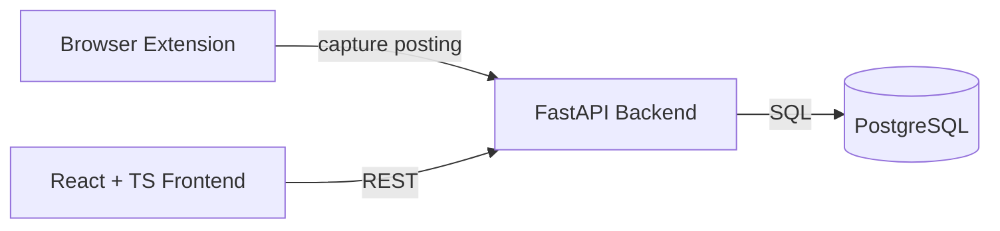

# OfferFlow Architecture

> Living document. Updated as the project evolves.

## Overview

OfferFlow is a full-stack job application tracker composed of three deployable parts plus a
shared PostgreSQL database.

## Components

### Frontend (`frontend/`)
- React + TypeScript (Vite).
- Talks to the backend over a REST API.
- Displays and manages tracked applications.

### Backend (`backend/`)
- Python + FastAPI.
- Owns business logic and persistence.
- Exposes a REST API consumed by the frontend and extension.

### Extension (`extension/`)
- Browser extension (Manifest V3).
- Captures job postings and forwards them to the backend.

### Database
- PostgreSQL stores applications, statuses, and related metadata.

## Out of Scope (for now)

- Gmail integration
- Calendar integration
- AI features
