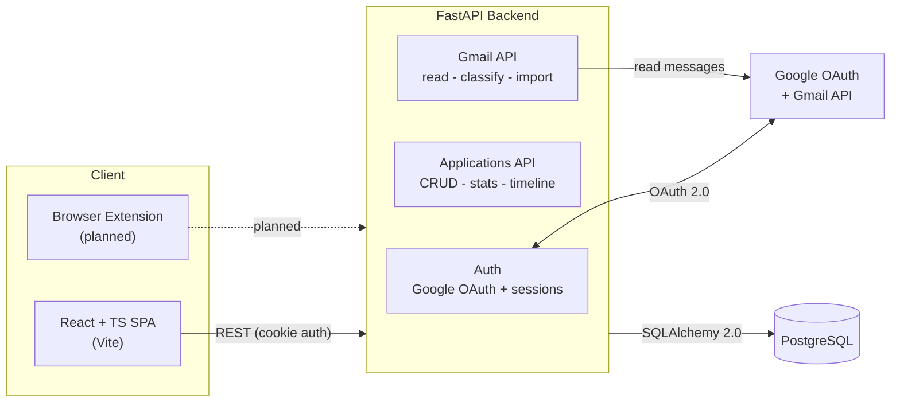
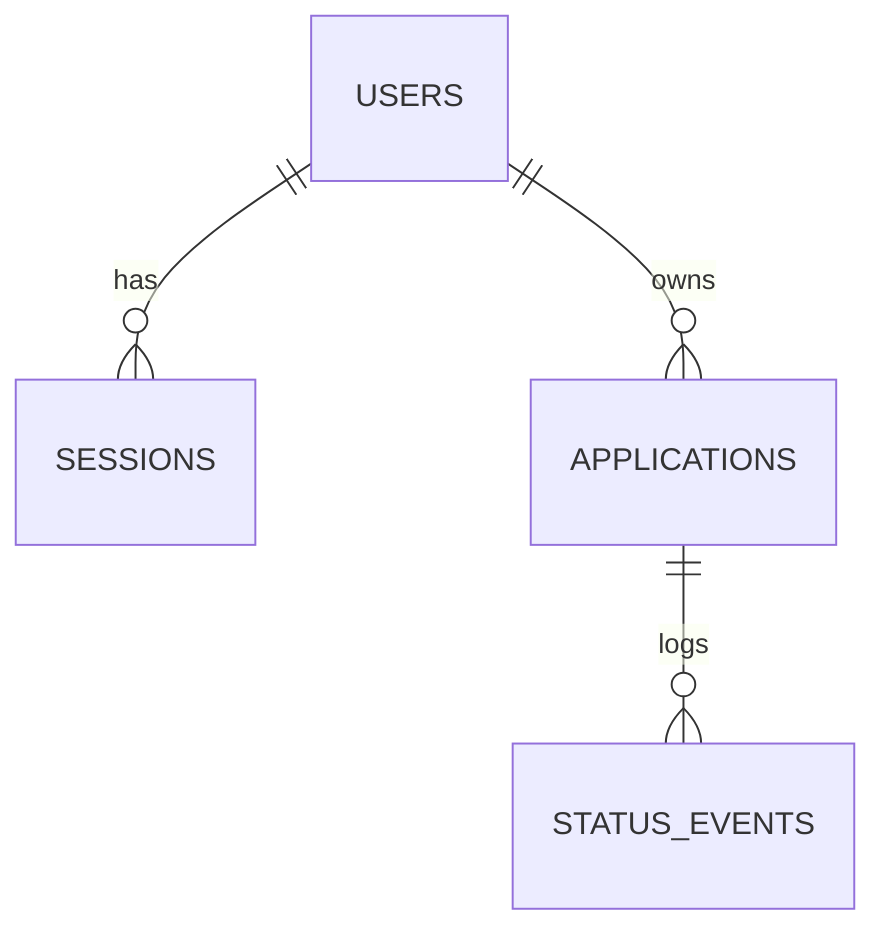
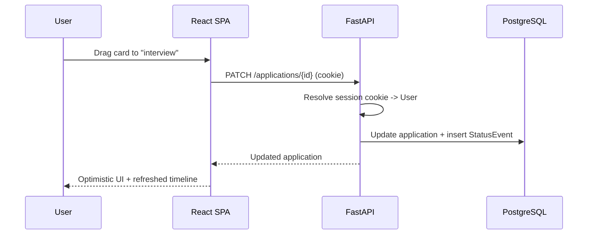

# OfferFlow Architecture

> Living document. Updated as the project evolves.

## Overview

OfferFlow is a full-stack job application tracker: a React single-page app talking to a
FastAPI backend over a cookie-authenticated REST API, with PostgreSQL for persistence and
Google (OAuth + Gmail) as an external identity and data source.

## Components

### Frontend (`frontend/`)
- React 18 + TypeScript (Vite).
- Calls the backend with `credentials: include` so the session cookie is always sent.
- Two synchronized views (Kanban board via dnd-kit, and a sortable/searchable table),
  a slide-out detail drawer with an activity timeline, a command palette, and themeable UI.

### Backend (`backend/`)
- Python + FastAPI, organized into routers: `auth`, `applications`, `gmail`.
- SQLAlchemy 2.0 typed models; Pydantic v2 schemas; a thin CRUD/data-access layer.
- Owns business logic: per-user scoping, timeline event recording on status change, and
  Gmail classification/import.

### Authentication
- Google OAuth 2.0 via Authlib. On callback the backend upserts the user, stores Google
  tokens (for Gmail), and creates a **server-side session** identified by an opaque,
  httpOnly cookie. A dependency resolves that cookie to the current `User` on each request.

### Database
- PostgreSQL in production, SQLite for local dev. Schema is managed exclusively by **Alembic
  migrations** (no runtime `create_all`); migrations run automatically on deploy.

### Extension (`extension/`) — planned
- A Manifest V3 browser extension to capture job postings in one click and forward them to
  the backend.

## Data Model

- **User** — a Google-authenticated person; holds profile info and Google OAuth tokens.
- **Session** — an opaque server-side login token with an expiry, mapped to a cookie.
- **Application** — a tracked job/internship with company, position, status, optional
  follow-up date, and provenance (`manual` or `gmail`, deduped by `gmail_thread_id`).
- **StatusEvent** — one row when an application first appears (`from_status = NULL`) and one
  per subsequent status change; this is the activity timeline.

## Request Flow (status change example)

## Quality & Delivery

- **Tests:** pytest (backend, isolated in-memory DB per test) and Vitest + React Testing
  Library (frontend).
- **CI:** GitHub Actions runs backend tests and the frontend test + build on every push/PR.
- **Deployment:** a Render blueprint (`render.yaml`) provisions Postgres + the API and runs
  migrations on deploy; the frontend is Vercel-ready via `VITE_API_URL`. Cross-site auth is
  handled with `SameSite=None; Secure` cookies and env-driven CORS.
